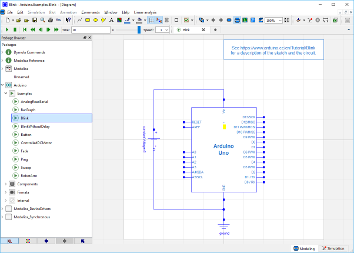

# Simulate Arduino Sketches in Modelica

With the Arduino Modelica library you can simulate your circuits and [sketches](https://www.arduino.cc/en/Tutorial/Sketch) on a virtual [Arduino Uno](https://www.arduino.cc/en/Main/ArduinoBoardUno) and connect your [Modelica](https://www.modelica.org/) models to real-world circuits using the [Firmata protocol](http://www.firmata.org/).

## Prerequisites

- [Dymola](https://www.3ds.com/products-services/catia/products/dymola) 2017 FD01 or later
- Visual Studio 2015

## Getting Started

- download the [latest release](releases/latest) and extract the archive
- in Dymola select `File > Open...` and open `Arduino/package.mo` from the extracted files
- in the package browser double-click `Arduino.Examples.Blink`
- right-click on the toolbar and check `Simulation` and `Animation` to view the simulation and animation toolbars
- open the `Simulation Setup`  and on the `Compiler` tab select `Visual Studio 2015/Visual Studio C++ Express Edition (14.0)`
- click  to run the Simulation
- after the simulation has finished click  in the animation toolbar and watch the LED `L` blink

- try the other examples in `Arduino.Examples`

## Simulate your Sketch

To simulate your sketch `MySketch` you have to perform the following steps.

- save your sketch as `Arduino/Resources/Sketches/MySketch.ino`
- add the block `Arduino.Components.ArduinoUno` to your model
- double-click the block and set the parameter `sketch` to `"MySketch.ino"`
- click  to re-translate the model when the sketch has changed

## Limitations

- currently you can use only one instance of ArduinoUno in your Modelica model

- the whole [Arduino API](https://www.arduino.cc/en/Reference/HomePage) is supported except for the following functions

	- [analogReadResolution()](https://www.arduino.cc/en/Reference/AnalogReadResolution)
	- [analogWriteResolution()](https://www.arduino.cc/en/Reference/AnalogWriteResolution)
	- [tone()](https://www.arduino.cc/en/Reference/Tone)
	- [noTone()](https://www.arduino.cc/en/Reference/NoTone)
	- [shiftOut()](https://www.arduino.cc/en/Reference/ShiftOut)
	- [shiftIn()](https://www.arduino.cc/en/Reference/ShiftIn)
	- [isWhitespace()](https://www.arduino.cc/en/Reference/IsWhitespace)
	- [Serial](https://www.arduino.cc/en/Reference/Serial) `print(), println() and write() are supported`
	- [Stream](https://www.arduino.cc/en/Reference/Stream)
	- [Keyboard](https://www.arduino.cc/en/Reference/MouseKeyboard)
	- [Mouse](https://www.arduino.cc/en/Reference/MouseKeyboard)

## Arduino Libraries

The following libraries are included and can be used directly.

| Name                            | Description |
|---------------------------------|-------------|
|[Servo.h](Libraries/Servo.h)     | [Servo library](https://www.arduino.cc/en/Reference/Servo) to control RC (hobby) servo motors |
|[PID_v1.h](Libraries/PID_v1.h)   | PID controller library for Arduino |

To use an external library in your sketch copy its header files (`*.h`) and source files (`*.cpp`) to the `Libraries` folder. If the library contains `.cpp` files you have to add them to the `Arduino` project by dragging them from the `Libraries` folder in the file browser onto the `Source Files` folder in the solution explorer.

## How does it work?

The ArduinoUno model is driven by an `ExternalObject` that contains the compiled sketch and an implementation of the Arduino API. The external object is synchronized at every sample interval with the Modelica model.

When a model that contains the `ArduinoUno` block is translated the external object is automatically re-built through the `preInstantiate=Arduino.Internal.buildSketch(...)` directive in its annotation.

This function writes a new `Sketch.cpp` to `Arduino/Resources/Source/Arduino` that includes the sketch currently selected in the ArduinoUno component and calls the build script `build_sketch.bat`.

This script re-builds the shared libraries `Arduino/Resources/Library/win32/ModelicaArduino.dll` and `win64/ModelicaArduino.dll` that contain the implementation of the external object.

## Debugging a Sketch

- translate and simulate the model you want to debug
- open `VisualStudio/Arduino.sln` in VisualStudio
- select `Debug` as configuration and the platform that matches your Dymola model (`x64` if `Advanced.CompileWith64 = 2` otherwise `Win32`)
- open the project settings and under `Debug` set `Command` to `dymosim.exe` and `Working Directory` to your current Dymola working directory
- open the sketch in VisualStudio and set a breakpoint
- start debugging

## Copyright and License

Copyright &copy; 2018 [Dassault Systèmes](https://www.3ds.com/). The code is licensed [GPLv3](https://www.gnu.org/licenses/gpl-3.0.en.html), the documentation [CC BY-SA 4.0](https://creativecommons.org/licenses/by-sa/4.0/).
